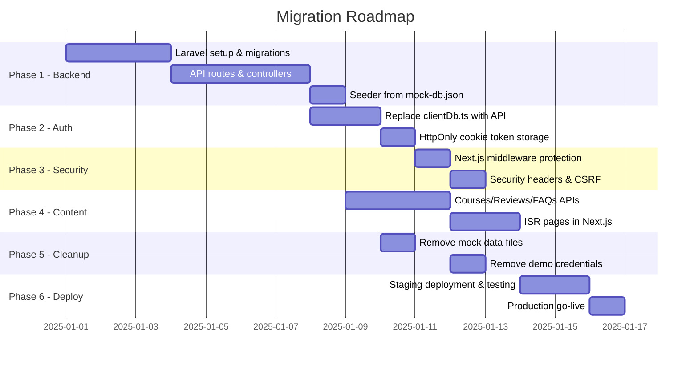

# Full-Stack Migration Workflow
## Ibrahim Tuition App — Static Mock → Dynamic Production

> [!IMPORTANT]
> This document is the complete engineering playbook for replacing all mock data (`localStorage`, `mock-db.json`) with real API calls, adding server-side security, and deploying to production.

---

## Current State (What Exists)

| Layer | Current Implementation | Problem |
|---|---|---|
| **Database** | `src/data/mock-db.json` | Flat file, no persistence across sessions |
| **Authentication** | `localStorage.ibt_mock_session` | No server validation — anyone can forge a session |
| **Data Operations** | `src/lib/clientDb.ts` (localStorage reads/writes) | All data is client-side, wiped on browser clear |
| **Route Protection** | `portal/layout.tsx` checks localStorage | Client-side only — easily bypassed |
| **Passwords** | Plaintext in `mock-db.json` (`password123`) | Critical security risk |
| **Public Content** | Hardcoded JSON in `src/data/*.json` | Cannot be edited without a code deploy |
| **Contact Form** | No backend handler | Submissions go nowhere |

---

## Target Architecture

```
┌─────────────────────────────┐      ┌──────────────────────────────┐
│   Next.js Frontend          │      │   Laravel Backend API        │
│   (ibrahimtuition.co.uk)    │ ──── │   (api.ibrahimtuition.co.uk) │
│                             │ HTTP │                              │
│  - Public Pages (SSG/ISR)   │      │  - Authentication (Sanctum)  │
│  - Portal (CSR + SSR)       │      │  - MySQL Database            │
│  - Next.js Middleware Auth  │      │  - Role-based Middleware     │
│  - API Route Proxying       │      │  - File Storage (S3)         │
└─────────────────────────────┘      └──────────────────────────────┘
```

---

## Phase 1 — Backend API (Laravel)

**Goal**: Set up the Laravel project and build all API endpoints.

### 1.1 Database Migrations

Based on `mock-db.json`, create 5 migrations in this order:

```
users          → id, name, email, password (hashed), role, email_verified_at, timestamps
students       → id, user_id (FK), parent_name, parent_email, phone, level, subjects (json), fee_status, progress, timestamps
teachers       → id, user_id (FK), name, email, subjects (json), timestamps
classes        → id, subject, teacher_id (FK), time, day, type, max_students, timestamps
class_student  → id, class_id (FK), student_id (FK), timestamps (pivot)
homeworks      → id, student_id (FK), title, url, status, due_date, timestamps
schedules      → id, teacher_id (FK), student_id (FK), subject, time, day, timestamps
```

### 1.2 Eloquent Models & Relationships

```php
// User → hasOne Student or Teacher (polymorphic via role)
// Student → belongsTo User, belongsToMany Class, hasMany Homework
// Teacher → belongsTo User, hasMany Class, hasMany Schedule
// Class → belongsTo Teacher, belongsToMany Student
```

### 1.3 REST API Routes (`routes/api.php`)

```php
// Public
POST   /api/login         → AuthController@login
POST   /api/contact       → ContactController@send

// Authenticated (Sanctum)
POST   /api/logout        → AuthController@logout
GET    /api/user          → AuthController@me

// Admin only
GET    /api/admin/stats          → AdminController@stats
GET    /api/users                → UserController@index
POST   /api/users                → UserController@store
DELETE /api/users/{id}           → UserController@destroy
GET    /api/students             → StudentController@index
PATCH  /api/students/{id}        → StudentController@update
DELETE /api/students/{id}        → StudentController@destroy
GET    /api/classes              → ClassController@index
POST   /api/classes              → ClassController@store
DELETE /api/classes/{id}         → ClassController@destroy

// Teacher only
GET    /api/teacher/profile      → TeacherController@profile
GET    /api/teacher/schedule     → TeacherController@schedule
PATCH  /api/teacher/students/{id}→ TeacherController@updateStudent

// Student only
GET    /api/student/profile      → StudentController@profile
GET    /api/student/homework     → HomeworkController@index
PATCH  /api/student/homework/{id}→ HomeworkController@update
```

### 1.4 Laravel Middleware

Create a custom `CheckRole` middleware to enforce role-based access:
```php
// app/Http/Middleware/CheckRole.php
public function handle($request, Closure $next, ...$roles) {
    if (!in_array($request->user()->role, $roles)) {
        return response()->json(['message' => 'Forbidden'], 403);
    }
    return $next($request);
}
```

Register it and apply: `middleware(['auth:sanctum', 'role:admin'])`

### 1.5 Database Seeder

Port `mock-db.json` data into a Laravel seeder to populate a real MySQL database using **bcrypt-hashed passwords** (replacing `password123`).

---

## Phase 2 — Authentication Migration (Critical Security Fix)

**Goal**: Replace localStorage fake sessions with real server-issued tokens.

### 2.1 Laravel Side — Sanctum Token Auth

`POST /api/login` should return:
```json
{
  "token": "1|aBcDeFgH...",
  "user": { "id": 1, "name": "Admin User", "role": "admin" }
}
```

### 2.2 Frontend — Update `src/lib/clientDb.ts`

Replace the entire file with a typed API client:

```typescript
// src/lib/api.ts  (replaces clientDb.ts)
const API_BASE = process.env.NEXT_PUBLIC_API_URL;

function getToken() {
  return typeof window !== 'undefined' 
    ? localStorage.getItem('ibt_token') 
    : null;
}

async function apiFetch(path: string, options: RequestInit = {}) {
  const token = getToken();
  const res = await fetch(`${API_BASE}${path}`, {
    ...options,
    headers: {
      'Content-Type': 'application/json',
      'Accept': 'application/json',
      ...(token ? { Authorization: `Bearer ${token}` } : {}),
      ...options.headers,
    },
  });
  if (!res.ok) {
    const err = await res.json();
    throw new Error(err.message || 'API Error');
  }
  return res.json();
}

export async function login(email: string, password: string) {
  const data = await apiFetch('/api/login', {
    method: 'POST',
    body: JSON.stringify({ email, password }),
  });
  localStorage.setItem('ibt_token', data.token);
  localStorage.setItem('ibt_session', JSON.stringify(data.user));
  return data.user;
}

export async function logout() {
  await apiFetch('/api/logout', { method: 'POST' });
  localStorage.removeItem('ibt_token');
  localStorage.removeItem('ibt_session');
}

export const getStats = () => apiFetch('/api/admin/stats');
export const getAllUsers = () => apiFetch('/api/users');
export const getAllStudents = () => apiFetch('/api/students');
export const getClasses = () => apiFetch('/api/classes');
export const createUser = (data: any) => apiFetch('/api/users', { method: 'POST', body: JSON.stringify(data) });
export const deleteUser = (id: string) => apiFetch(`/api/users/${id}`, { method: 'DELETE' });
export const updateStudent = (id: string, data: any) => apiFetch(`/api/students/${id}`, { method: 'PATCH', body: JSON.stringify(data) });
```

### 2.3 Add `.env.local`

```bash
# .env.local (never commit this file)
NEXT_PUBLIC_API_URL=http://localhost:8000
```

---

## Phase 3 — Route Protection (Server-Side Middleware)

**Goal**: Move auth protection from the browser (easily bypassed) to Next.js server middleware.

> [!WARNING]
> Currently, the portal layout only checks localStorage. This means a user can bypass login by manually setting a value in localStorage. Server-side middleware is the only real protection.

### Create `middleware.ts` at the project root:

```typescript
// middleware.ts
import { NextResponse } from 'next/server';
import type { NextRequest } from 'next/server';

export function middleware(request: NextRequest) {
  const token = request.cookies.get('ibt_token')?.value;
  const { pathname } = request.nextUrl;

  // Redirect unauthenticated users away from portal
  if (pathname.startsWith('/portal') && !token) {
    return NextResponse.redirect(new URL('/login', request.url));
  }

  // Redirect logged-in users away from login page
  if (pathname === '/login' && token) {
    return NextResponse.redirect(new URL('/portal/student', request.url));
  }

  return NextResponse.next();
}

export const config = {
  matcher: ['/portal/:path*', '/login'],
};
```

> [!IMPORTANT]
> This requires storing the token in an `HttpOnly` cookie (not localStorage) for the middleware to read it. Update the `login` function to set a cookie instead of or in addition to localStorage.

---

## Phase 4 — Dynamic Public Content

**Goal**: Allow the admin to update courses, testimonials, and site info without code deployments.

### Current hardcoded JSON files to migrate:

| File | New API Endpoint | Admin Action |
|---|---|---|
| `src/data/courses.json` | `GET /api/courses` | Manage via admin portal |
| `src/data/reviews.json` | `GET /api/reviews` | Manage via admin portal |
| `src/data/subjects.json` | `GET /api/subjects` | Manage via admin portal |
| `src/data/faq.json` | `GET /api/faqs` | Manage via admin portal |
| `src/data/services.json` | `GET /api/services` | Manage via admin portal |

### Next.js Data Fetching Strategy:

```typescript
// src/app/courses/page.tsx — Server Component with ISR
export const revalidate = 3600; // Revalidate every 1 hour

async function getCourses() {
  const res = await fetch(`${process.env.NEXT_PUBLIC_API_URL}/api/courses`, {
    next: { revalidate: 3600 }
  });
  return res.json();
}

export default async function CoursesPage() {
  const courses = await getCourses();
  // ... render
}
```

---

## Phase 5 — Security Hardening Checklist

> [!CAUTION]
> All of these must be implemented before going live.

### Frontend (Next.js)

- [ ] **Remove all demo credentials** from the login page (`defaultValue` fields and demo account hints)
- [ ] **Remove `mock-db.json`** and `clientDb.ts` after API migration
- [ ] **Move token to HttpOnly cookie** — prevents XSS from stealing the token
- [ ] **Add Next.js Middleware** route protection (Phase 3)
- [ ] **CSRF Protection** — add `X-XSRF-TOKEN` header for state-changing requests
- [ ] **Add Security Headers** in `next.config.ts`:
  ```typescript
  headers: async () => [{
    source: '/(.*)',
    headers: [
      { key: 'X-Frame-Options', value: 'SAMEORIGIN' },
      { key: 'X-Content-Type-Options', value: 'nosniff' },
      { key: 'Referrer-Policy', value: 'strict-origin-when-cross-origin' },
      { key: 'Content-Security-Policy', value: "default-src 'self'..." },
    ]
  }]
  ```
- [ ] **Environment Variables** — all secrets in `.env.local`, never commit to git
- [ ] **Update `.gitignore`** to include `.env.local`
- [ ] **Rate-limit the contact form** via API middleware
- [ ] **Input sanitization** — add `zod` validation schemas for all form submissions

### Backend (Laravel)

- [ ] **Hash all passwords** with `bcrypt` — never store plaintext
- [ ] **Configure CORS** with `config/cors.php` to only allow the Next.js domain
- [ ] **Sanctum expiry** — set token expiration to 24 hours or less
- [ ] **Validate all API inputs** with Laravel Form Requests
- [ ] **Rate limiting** on login endpoint to prevent brute-force
- [ ] **Disable `APP_DEBUG=true`** in production `.env`
- [ ] **Use HTTPS** with SSL certificates on both domains

---

## Phase 6 — Contact Form Integration

**Goal**: Wire up the contact form (`src/components/contact/ContactForm.tsx`) to send real email.

```php
// Laravel: POST /api/contact → ContactController@send
public function send(Request $request) {
    $request->validate([
        'name' => 'required|string|max:100',
        'email' => 'required|email',
        'phone' => 'nullable|string|max:20',
        'message' => 'required|string|max:2000',
    ]);

    Mail::to(config('mail.admin_address'))->send(new ContactFormMail($request->all()));
    return response()->json(['message' => 'Your message has been sent!']);
}
```

---

## Phase 7 — Deployment

### Recommended Stack

| Service | Purpose |
|---|---|
| **Vercel** | Next.js hosting (auto-deploy from Git, handles CDN, ISR) |
| **Laravel Forge / Railway** | Laravel API hosting |
| **PlanetScale / MySQL on AWS RDS** | Managed MySQL database |
| **Cloudflare** | DNS, DDoS protection, and CDN |
| **Amazon S3 / Cloudflare R2** | File/image storage |

### Environment Variables Required

```bash
# Next.js Production (.env.production)
NEXT_PUBLIC_API_URL=https://api.ibrahimtuition.co.uk
NEXT_PUBLIC_GA_ID=G-XXXXXXXXXX

# Laravel Production (.env)
APP_ENV=production
APP_DEBUG=false
APP_URL=https://api.ibrahimtuition.co.uk
DB_HOST=your-db-host
DB_DATABASE=ibt_production
DB_USERNAME=ibt_user
DB_PASSWORD=your-secure-password
SANCTUM_STATEFUL_DOMAINS=ibrahimtuition.co.uk
FRONTEND_URL=https://ibrahimtuition.co.uk
MAIL_MAILER=smtp
MAIL_HOST=smtp.mailgun.org
```

---

## Suggested Implementation Order



---

## Files to Create / Modify Summary

| File | Action | Phase |
|---|---|---|
| `src/lib/api.ts` | **CREATE** — replaces clientDb.ts | 2 |
| `src/lib/clientDb.ts` | **DELETE** | 2 |
| `src/data/mock-db.json` | **DELETE** | 2 |
| `middleware.ts` | **CREATE** — route protection | 3 |
| `src/app/login/page.tsx` | **MODIFY** — remove demo credentials | 2 |
| `src/app/portal/layout.tsx` | **MODIFY** — use cookie session instead of localStorage | 2 |
| `src/app/portal/admin/page.tsx` | **MODIFY** — call real API | 2 |
| `src/app/portal/teacher/page.tsx` | **MODIFY** — call real API | 2 |
| `src/app/portal/student/page.tsx` | **MODIFY** — call real API | 2 |
| `src/app/courses/page.tsx` | **MODIFY** — fetch from API with ISR | 4 |
| `next.config.ts` | **MODIFY** — add security headers | 5 |
| `.env.local` | **CREATE** | 2 |
| `.gitignore` | **MODIFY** — ensure .env.local excluded | 2 |
